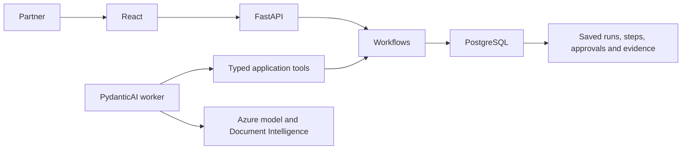

# Architecture and decisions

React provides forms and the assistant review screen. FastAPI authenticates sessions, validates typed requests and calls application operations. SQLAlchemy owns one PostgreSQL transaction per command. Alembic versions the schema. PydanticAI selects scoped application tools from a natural-language goal; it has no shell or arbitrary SQL tool.

## Business flow

1. Upload a bill or type what was bought. The assistant checks duplicates and saved parts, extracts the bill when attached and prepares editable product/family proposals.
2. A partner checks exact variants, units, buying rates and selling prices. Unknown values remain unresolved. New parts are created only when the reviewed intake is posted.
3. Approving an incoming bill does **not** increase available stock.
4. Once goods arrive, the partner counts accepted, damaged and on-hold units and approves physical receipt. Only accepted goods can be sold.
5. Checkout deducts the entire basket atomically. Fitting/service charges create no stock movements. Readback confirms the saved sale and remaining stock.
6. Mistakes use linked returns, reversals or reasoned adjustments; original history remains immutable. Goods without bills can use a partner-confirmed no-bill receipt with evidence and explicit units.

## Why these choices

- Modular monolith: stock and business documents can commit in one transaction without distributed compensation.
- Ledger plus balances: fast queries with a reconstructable explanation for every stock change.
- PostgreSQL row locks: concurrent final-unit sales cannot both succeed. Idempotency keys prevent repeat posting after a lost response.
- Whole base units and integer paise: arithmetic and conversions are deterministic. Unknown pack factors are rejected.
- Typed Pydantic tools: the model sees required fields instead of guessing dictionary keys.
- PydanticAI with a small database-backed worker: persisted runs, leases, bounded retries and approval/resumption without another orchestration platform.
- A partner controls pricing and posting. AI provides proposals and evidence, not permission to change stock.

## Agent execution

Tools include document lookup/extraction, catalogue and family lookup, duplicate checks, intake/purchase/receipt preparation, deferred posting approval, transaction verification and shortage-report save/readback. The model chooses meaningful next actions from observed results. Posting tools call the same deterministic services used by the UI.

Each run stores its goal, messages, tool arguments/results, request/tool usage, status and approvals. Limits are 10 model-request slots and 20 tools; extraction reserves two classifier slots. External clients have at most two retries. Approval applies to the exact draft version; editing invalidates it. A completed outcome requires saved-result readback. This evidence gate does not prove that every natural-language statement is correct; partners must review model interpretation.

The bill classifier uses the configured Azure-hosted Claude deployment, followed by Azure Document Intelligence prebuilt invoice/receipt extraction. Indian supplier fields are preserved without assumed VAT customers, default GST rates or invented GSTIN/HSN. Internal counter records are not legal tax invoices.

Server sessions use hashed passwords, HTTP-only cookies and CSRF checks. Existing staff permissions hide purchase costs at the API; current product rollout focuses on partners. Keep credentials, uploads, backups and real business records outside Git.
